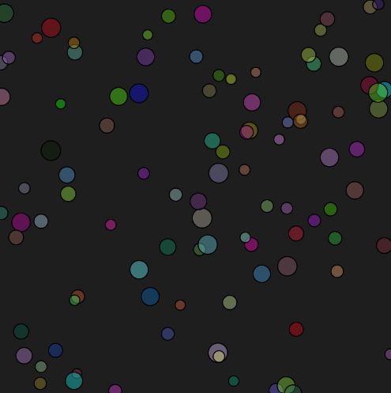

#### Solución actividad 9 

#### Funciones utilizadas

##### setup():
Esta función se ejecuta una vez al inicio del programa.
Se utiliza para configurar las propiedades iniciales del lienzo.

##### En el código:
createCanvas(400, 400): Crea un lienzo de 400x400 píxeles.
noLoop(): Detiene la repetición del ciclo de dibujo, haciendo que la función draw() se ejecute una sola vez.

##### draw():
Contiene las instrucciones para dibujar en el lienzo.
##### En el código:
background(30): Establece un color de fondo oscuro (valor RGB 30, que corresponde a un gris oscuro).
Un bucle for genera 100 elipses con posiciones, tamaños y colores aleatorios.

##### Funciones adicionales dentro de draw():
random(): Genera valores aleatorios dentro de un rango. Se usa para las posiciones x y y, el tamaño y los colores de las elipses.
fill(r, g, b, alpha): Define el color de relleno de las formas. Los valores RGB y de transparencia (alpha) se generan aleatoriamente.
ellipse(x, y, w, h): Dibuja una elipse en la posición (x, y) con ancho w y alto h.

##### Modificaciones de los parámetros:
##### Tamaño del lienzo:
Usé createCanvas(400, 400) para definir un espacio limitado pero suficientemente grande para mostrar las 100 elipses.
Tamaño de las elipses:
Establecí un rango de tamaños con random(10, 20) para dar variedad a las formas.
Colores y transparencia:
Generé colores aleatorios con fill(random(255), random(255), random(255), 100), donde el valor de alpha fija una transparencia parcial para las elipses.
Posiciones aleatorias:
Las posiciones x y y se asignan con random(width) y random(height) para que las elipses se distribuyan por todo el lienzo.

